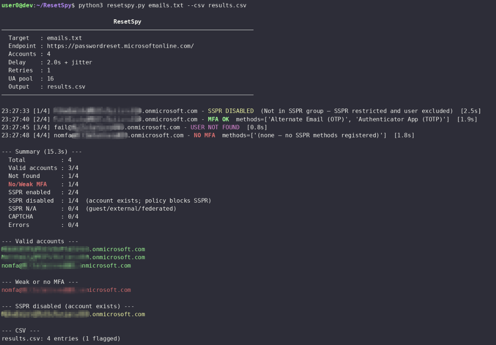

# ResetSpy

Probe Microsoft's Self-Service Password Reset (SSPR) endpoint to enumerate
registeted verification methods and flag any that
lack a strong second factor. Provides user enumeration and an approximation
of MFA posture across Entra accounts.

<p align="center">
  
</p>

> [!NOTE]
> As of August 2026, Microsoft has removed the legacy CAPTCHA from the SSPR flow and replaced it with backend throttling and behaviour-based abuse detection (see [MC1400824](https://mc.merill.net/message/MC1400824)). Microsoft's position is that the backend controls are sufficient to detect and block automated abuse.

## Table of Contents

- [Installation](#installation)
  - [pipx](#pipx)
  - [pip](#pip)
- [Usage](#usage)
  - [Examples](#examples)
  - [Options](#options)
  - [Rate Limiting](#rate-limiting)
- [Accuracy and Limitations](#accuracy-and-limitations)
  - [TL;DR](#tldr)
  - [Why SSPR results are a reasonable MFA proxy](#why-sspr-results-are-a-reasonable-mfa-proxy)
  - [Known shortcomings](#known-shortcomings)
  - [Capability summary](#summary-of-what-the-tool-does-and-does-not-provide)
- [How it works](#how-it-works)
  - [TL;DR](#tldr-1)
  - [Method classification](#method-classification)
  - [Results](#results)
- [Thanks](#thanks)

# Installation

## pipx

```bash
# Install pipx if needed
apt install pipx && pipx ensurepath

# From a local clone
git clone https://github.com/mlcsec/ResetSpy.git
cd ResetSpy
pipx install .
```

## pip

```bash
python3 -m venv .venv
pip install -r requirements.txt
```

## Examples

```bash
# Single acc
resetspy user@example.com

# Email file (one per line)
resetspy emails.txt

# Proxy
resetspy emails.txt --proxy http://127.0.0.1:8080

# Export to CSV with increased delay
resetspy emails.txt --csv results.csv --delay 4

# Full HTTP debug — request/response headers and bodies printed to stderr
resetspy user@example.com -v
```

## Options

| Flag | Default | Description |
|---|---|---|
| `--delay SECONDS` | `2.0` | Base delay between requests; jitter added automatically |
| `--retries N` | `1` | Max retries per account on transient errors |
| `--proxy URL` |  | Proxy; disables SSL verification automatically |
| `--csv FILE` |  | Export all results to CSV |
| `-v` / `--verbose` |  | Print full request/response headers and bodies to stderr |


## Rate limiting

A randomised jitter is added on top of `--delay` between every request.
Exponential back-off (up to `--retries` attempts) is applied on `429`
responses and network errors. The default delay is 2 seconds; increase to
4-6 seconds for large batches. The User-Agent is rotated from a pool of 16
common agents (Windows, macOS, iOS, Android) on every request.

---

# Accuracy and Limitations

## TL;DR

- SSPR method enumeration is a reasonable proxy for MFA posture on most modern Entra ID tenants due to combined registration
- Will not detect FIDO2 keys, certificate-based auth, or methods on guest/federated accounts
- Accounts where SSPR is disabled are confirmed to exist but their methods are unknown
- This is not a definitive MFA audit — understand what it does and does not see before relying on the output


## Why SSPR results are a reasonable MFA proxy

Microsoft's combined security information registration experience, enabled by default since 2020, registers authentication
methods for both SSPR and MFA in a single flow. In practice this means that
on most modern Entra ID tenants, the methods visible through SSPR are the
same methods protecting sign-in. An account with no strong SSPR method
registered is very likely an account with no strong MFA method registered.

References:
- [Combined security information registration overview](https://learn.microsoft.com/en-us/entra/identity/authentication/concept-registration-mfa-sspr-combined)
- [How it works: Azure AD self-service password reset](https://learn.microsoft.com/en-us/entra/identity/authentication/concept-sspr-howitworks)

## Known shortcomings

**SSPR and MFA are separate registries.** Combined registration makes them
overlap in most cases but they are not the same thing. A method can exist for
MFA without being visible here if it was registered before combined
registration was enabled, or if the admin excluded it from the SSPR policy.

**FIDO2 security keys and certificate-based authentication are not supported
by SSPR.** Microsoft has never added these methods to the SSPR flow. A user
whose only registered factor is a FIDO2 key or smart card will appear here as
having no methods — a false negative. In practice this is rare for standard
users but more common in high-security or passwordless environments.

References:
- [Authentication methods available for SSPR](https://learn.microsoft.com/en-us/entra/identity/authentication/concept-authentication-methods)
- [FIDO2 security key sign-in](https://learn.microsoft.com/en-us/entra/identity/authentication/howto-authentication-passwordless-security-key)

**Per-method policy mismatches.** Admins can permit a method for MFA
sign-in but exclude it from the SSPR policy, or vice versa. For example an
organisation might allow authenticator push for sign-in but not for password
reset. The tool only sees what SSPR is willing to offer.

**SSPR disabled entirely (SSPR_0011).** If SSPR is not licensed or not
enabled for a user, the endpoint returns `ViewSsprNotEnabledInUserPolicy`
and no method information is available. The account exists and likely has MFA
configured, but this tool cannot determine what.

**Guest and federated accounts.** External users and B2B guests authenticate
through their home tenant. The resource tenant's SSPR endpoint has no
visibility into their home tenant's MFA registration and returns
`ViewFeatureNotAvailable`. Their MFA posture is invisible from this endpoint.

**Tenant-wide method restrictions.** If an admin has disabled a method class
in the SSPR policy, it will not be offered to any user regardless of
individual registration, making it impossible to distinguish "method not
registered" from "method disabled".

**Administrator accounts are always SSPR-enabled.** Microsoft's SSPR policy
settings apply only to standard end users. Administrator accounts are always
enabled for self-service password reset regardless of the tenant SSPR policy,
and Microsoft requires them to have two authentication methods registered. This
is enforced at the platform level and cannot be disabled by tenant admins.

Reference: [SSPR policy documentation](https://aka.ms/sspr-policies)

> [!IMPORTANT]
> This has a useful implication for reconnaissance. If SSPR is disabled for
> standard users in a tenant (returning `ViewSsprNotEnabledInUserPolicy`), any
> account that successfully reaches the method selection screen is likely a
> member of a privileged role. Accounts that enumerate cleanly via SSPR when
> the broader tenant policy is disabled stand out as probable admin accounts,
> and their registered methods are visible even when standard user methods are
> not. This allows for identification of high-value targets and privileged accounts
> that can be singled out for further targetted attacks.

## Summary of what the tool does and does not provide

| Capability | Supported |
|---|---|
| User enumeration (account exists or not) | Yes |
| SSPR method enumeration | Yes |
| MFA method inference (via combined registration) | Approximate — reliable for most standard tenants |
| FIDO2 / certificate-based MFA detection | No |
| Guest / federated account MFA | No |
| Accounts with SSPR disabled | No (account confirmed to exist, methods unknown) |
| Admin account identification | Partial — admins are always SSPR-enabled, so they may stand out when tenant SSPR is otherwise disabled |


---

# How it works

## TL;DR

- Two requests per target: a GET to obtain session tokens, then a POST replicating the browser's async form submission
- The server's `CurrentViewName` response field is used as the ground truth for the result — not HTML body matching
- User-Agent is rotated per request from a pool of 16 realistic browser strings
- Jitter and exponential back-off are applied automatically to avoid rate limiting

## Overview

Microsoft's SSPR portal (`passwordreset.microsoftonline.com`) shows a
contact-method selection screen (`MultigateAuthenticationControl`) after
accepting a valid username. The HTML returned lists every registered
verification method as a radio button in `MultigateAuthenticationControl_RadioTable`.
Methods whose `<tr>` row is `display:none` are not registered for that user
and are skipped.

For each target, the tool performs two requests. First, a GET to the landing
page to establish a session and extract the ASP.NET form tokens (`__VIEWSTATE`,
`__EVENTVALIDATION`, `WorkflowConsistencyCheck`) that are required for the
server to accept a POST. These tokens are cryptographically bound to the
session cookie and cannot be predicted or reused across sessions. Second, a
POST that submits the email address alongside those tokens, replicating the
async UpdatePanel postback the browser performs when the user clicks Next.

The `CurrentViewName` hidden field in the ASP.NET wire response is used as the
authoritative signal for what the server decided, rather than substring
matching on the HTML body.

## Method classification

| Radio ID | Method | Strength |
|---|---|---|
| `MultigateAuthenticationControl_AltEmailRadio` | Alternate Email OTP | Weak |
| `MultigateAuthenticationControl_SecurityQuestionsRadio` | Security Questions | Weak |
| `MultigateAuthenticationControl_AppCodeRadio` | Authenticator App (TOTP) | Adequate |
| `MultigateAuthenticationControl_MobileAppNotificationRadio` | Authenticator Push Notification | Adequate |
| `MultigateAuthenticationControl_PhoneRadio` | Phone Call / SMS | Adequate |
| `MultigateAuthenticationControl_OfficePhoneRadio` | Office Phone | Adequate |

Alternate email and security questions are flagged as weak as they are
phishable and do not satisfy the intent of a second factor. Accounts with only weak methods, or no methods at all, are flagged.

> [!NOTE]
> Microsoft supports both software OATH tokens and hardware
> OATH tokens (preview) for SSPR. Software OATH tokens entered via the
> authenticator app most likely surface through the same `AppCodeRadio` button
> as TOTP — both present as a six-digit code entry — so they are probably
> already covered without a separate radio ID. Hardware OATH tokens (a physical
> keyfob) are a distinct device class but also produce a time-based code; they
> may render through the same button or a different one that has not yet been
> observed during testing of this process.

## Results

| Status | Meaning |
|---|---|
| `MFA OK` | Account found; at least one strong second factor registered in SSPR |
| `NO MFA` | Account found; no strong factor (weak-only or no methods registered) |
| `NOT FOUND` | Username does not exist in the directory |
| `SSPR DISABLED` | Account exists but admin policy blocks SSPR (e.g. SSPR_0011) — methods unknown |
| `SSPR N/A` | Account type not supported by SSPR — guest, external, or federated users |
| `CAPTCHA` | Server presented a CAPTCHA; manual intervention required |
| `ERROR` | Unexpected response or network failure |

<br>

## Thanks 

- [RedByte1337/CredSpy](https://github.com/RedByte1337/CredSpy)
- Our kid Claude